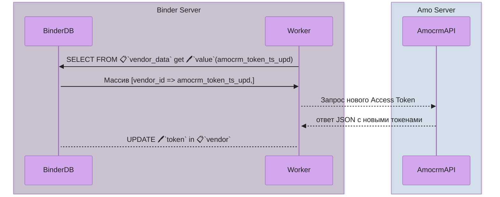

# Воркер `amocrm_refresh_token_worker`

Папка: `amocrm_refresh_token_worker`
Основной скрипт: `AmocrmTokenRefresher.php`
Worker для обновления Access Token доступа к Api аккаунтов Amocrm

#### Особенности:
Минимум зависимостей, вся логика в одном файле.

#### Зависимости:
- SafeMySQL class
- config.php (должен содержать глобальную переменную $config c ключом `db` (доступ к конфигу БД - `$config['db']`))

#### Другие файлы:
- amocrm_token_refresh.log - основной лог скрипта воркера, логирует перехваченные ошибки и ответы Amocrm с токенами (дублирование данных, сохраняемых в базу)
- init.php - общий файл инициализации, не относится к основной логике, включает вывод ошибок, определяет хендлеры для необработанных ошибок и исключений, может быть отключен из файла воркера без последствий после окончания тестирования.
- worker_errors.log - ошибки и предупреждения PHP (относится к init.php)

#### Схема взаимодействия с другими системами:




#### Классы и методы:
HttpClient - встроенный HTTP клиент (AmoCRM REST API) (сервисный, не влияет на основную логику)
Logger - встроенный логгер (сервисный, не влияет на основную логику)
AmocrmTokenRefresher - Главный класс воркера с основной логикой
   Свойства:
       - $maxAttempts - число повторных попыток
       - $retryDelaySeconds - задержка между попытками,
       - $expirationThresholdSeconds - временной порог в секундах, по которому принимается решение о необходимости обновления токена
       - $clientId - ID приложения в Amocrm
       - $clientSecret - секретный ключ приложения в Amocrm
       - $redirectUri = адрес, который использовался для перенаправления при установке приложения (можно найти в скрипте установки)
   Методы:
        - checkAndRefreshTokens - главный метод, проверяет последний таймстемп обновления токена по каждому вендору Amocrm и если токен истекает, запускает процесс обновления
       - refreshToken - метод обновляющий access token в Amocrm (REST API метод `/oauth2/access_token`)
       - updateTokenInDb - обновление токена в базе данных Binder (далее БД) (vendor->token)
       - getVendors - получение всех вендоров Amocrm из БД
       - getLastTokenUpdates - получение всех значений `vendor_data` с именем `amocrm_token_ts_upd` (таймстемп последнего обновления)
       - getTestVendors - получение избранных вендоров в режиме DEBUG для отладки

> Если режим DEBUG == true, вендоры для обновления токена будут выбираться на основе массива `$testData` (имитирует массив результата выборки из БД) и использоваться метод `getTestVendors`, если DEBUG == false, то вендоры будут выбираться по всем данным в таблице `vendor`, где тип вендора `amocrm`, метод `getVendors`. Это ключевое отличие DEBUG режима.
> DEBUG устанавливается в `init.php` (если используется) и в самом файле воркера, если `init.php` не используется

## Сценарии:

#### Запуск единоразово:
```bash
php /var/www/path/to/worker/AmocrmTokenRefresher.php
```
#### Настройка срабатывания с определенным интервалом:
```bash
crontab -e
```
Добавить строку (запуск каждые 30 минут):
```
*/30 * * * * /usr/bin/php /var/www/path/to/worker/AmocrmTokenRefresher.php
```
> Измените путь к воркеру на действительный

#### Перемещении воркера в другую папку на сервере:
- изменить пути в директивах require_once для зависимостей, либо скопировать зависимости, соблюдая относительные пути
- перенастроить путь к файлу в cron

#### Изменение интервала срабатывания:
- изменить настройки cron

## TODO:
1. В данный момент установлен лимит на выборку вендоров в 1000. Необходимо продумать логику на случай, если вендоров будет больше и обрабатывать их какими-то порциями.
2. Реализовать отслеживание ошибок получения токенов (например, 2 неудачные попытки подряд). Если не получается обновить токен, надо сообщить пользователю, что он должен переустановить приложение